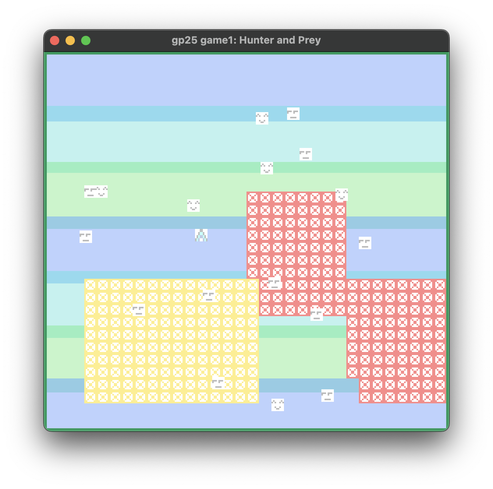
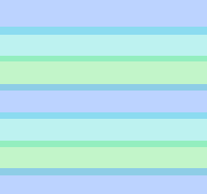
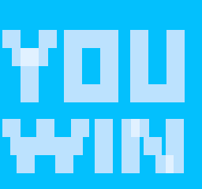
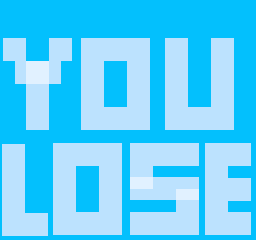

# Sprite-Based Game by Dennis

Author: Dennis Sun

Design: This game combines the mechanisms of avoiding traps on the ground, dodging enemies, and chasing targets. 

Screen Shot:

How Your Asset Pipeline Works:

For the background image, the asset pipeline utilizes the `load_png` function to load the asset file into the code. It then parses the image data and rearranges the pixel order into the 8x8 tile format supported by the PPU. Next, it parses each tile, generates the palette for the tile, checks and removes redundant palettes, and generates the tile bit planes. The palette is stored in the `palette_table`, the tile is stored in the `tile_table`, and the PPU `background` info is also written using the combination of the palette index and tile index.

For 8x8 pixel sprites, the asset pipeline directly parses the image data, generates the palette for the tile, and generates the tile bit planes. The palette is stored in the `palette_table`, and the tile is stored in the `tile_table`. The `index` and `attributes` of `struct Sprite` are written to store the sprite info.

Source Files:

Background

Sprites

    

How To Play:

Avoid the traps ()! When traps first appear, they are yellow. In this state, you can still step on them safely—they serve as a warning. When they turn red, if you step on them, you will lose the game. 

Dodge the  sprite! If you touch them, you will lose the game.

Chase the  sprite! Collect all of them to win the game.

Controls: Use the arrow keys to control player movement. 

This game was built with [NEST](NEST.md).

